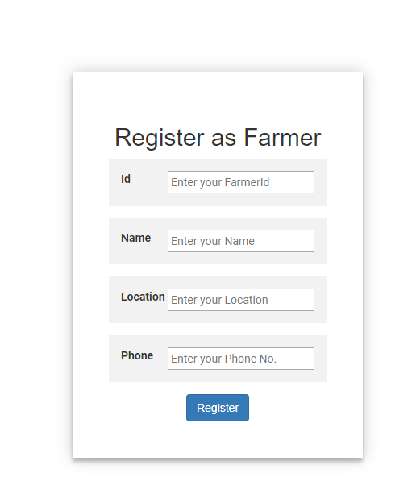
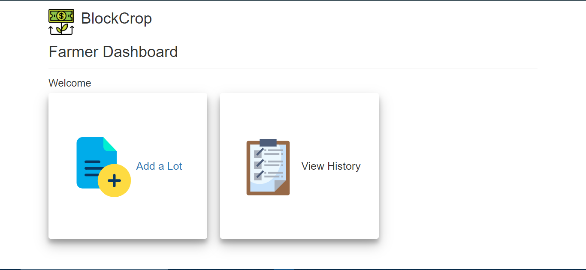
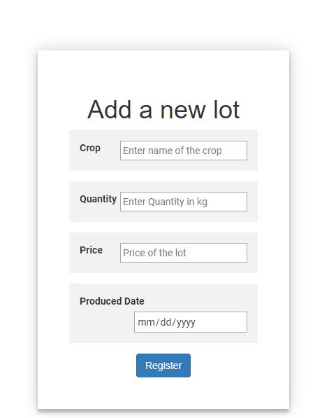
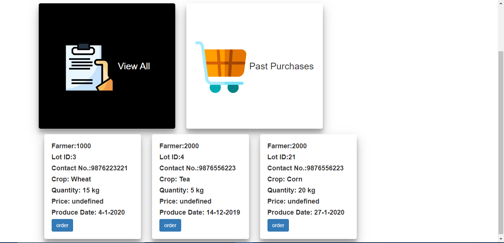

# BlockCrop-hackit
Blockchain Dapp made in hack it 2.0, kjsce.    
Winner of Matic's Hackit 2.0 hackathon bounty    
Devfolio link: https://devfolio.co/submissions/blockcrop    

Please refer truffle documentation to setup and run the project.      
Technology stack:  
Frontend: HTML, CSS, JavaScript  
Backend: Truffle, language: solidity  
Other: Web3.js, Metamask    
Following is the flow of the project:  
1. Index Page shows type of users:  
  
2. Register either as farmer or customer  

3. Farmer Dashboard  
  
4. Add a lot  
  
5. Customer Dashboard  
  
6. View available lots    
  
