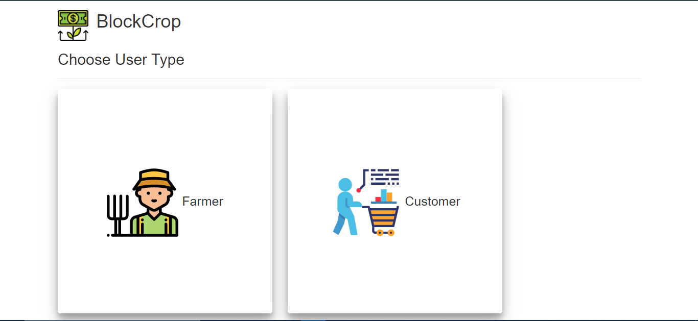

# BlockCrop-hackit
Blockchain Dapp made in hack it 2.0, kjsce.  
Please refer truffle documentation to setup and run the project.  
Following is the flow of the project:  
1. Index Page shows type of users:  
  
2. Farmer Dashboard  

3. Farmer Dashboard  
  
4. Add a lot  
  
5. Customer Dashboard  
  
6. View available lots  
  
